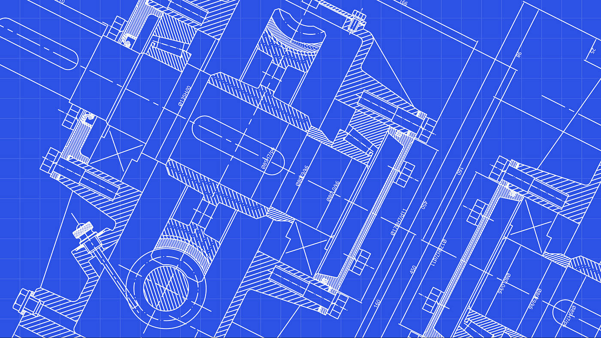

Software design patterns are general reusable solutions to common problems in software design. They are not set code, but rather descriptions or templates for how to solve a problem, which can be customized according to the specific needs of the software. It’s like a blueprint in construction, since different blueprints are used for different types of buildings. For instance, the blueprint for a house will be different from that of a skyscraper.

# Types of software design patterns

There are three main types of software design patterns:

Creational Patterns: These patterns provide rules for object creation. Examples include the Singleton Pattern, which ensures a class only has one instance, and the Factory Method Pattern, which allows a class to defer instantiation to subclasses.

Structural Patterns: These patterns focus on class and object composition. They include the Decorator Pattern, which dynamically adds behaviors to an object, and the Adapter Pattern, which allows classes with incompatible interfaces to work together.

Behavioral Patterns: These patterns deal with how objects interact with each other. The Observer Pattern, which defines how to notify changes in an object to other objects, and the Command Pattern, which encapsulates a request as an object, are examples of behavioral patterns.

# Example of a software design pattern used in code

In our project [askuh.info](https://askuh.info), we used the module pattern when designing our chatbot component. We have various parts that make up our chatbot, and instead of putting all the code into one file we separate the parts into different files for new components and pass in arguments in those new components.

```
<Container className="mt-5">
      <Row>
        {/* Chatbot Conversation Column */}
        <Col>
          <select value={userLanguage} onChange={handleLanguageSelect} className="mb-1">
            <option value="english">English</option>
            <option value="spanish">Español</option>
            <option value="japanese">日本語</option>
            <option value="chinese">中文</option>
            <option value="korean">한국어</option>

            {/* Add more languages as needed */}
          </select>
          <ChatWindow
            ref={chat}
            chatSender={chatSender}
            formatChatbotResponse={formatChatbotResponse}
            loading={loading}
          />
          <ChatInput
            ref={form}
            userInput={userInput}
            setUserInput={setUserInput}
            handleSend={handleSend}
            loading={loading}
          />
        </Col>
      </Row>
      {/* Similar articles cards */}
      <Row className="mt-5">
        <SimilarArticles similarArticles={similarArticles} opacity={opacity / 100} />
      </Row>
    </Container>
```

As you see here, the entire chatbot component is broken up into 3 distinct components, which are ChatWindow, ChatInput, and SimilarArticles. This modular approach enhances code readability and navigation, since it will be clear to see and find which parts contribute to the functionality of the chatbot.

# Importance

In conclusion, design patterns have a significant positive impact on software development by making the code more cohesive, understandable, maintainable, and scalable.

- When we talk about cohesiveness, design patterns help to keep code pieces that belong together in one place.

- Patterns are understandable since developers can have a faster time figuring out what the code is doing when they see shared concepts.

- Design patterns make the code evolve over time without becoming overly complex or hard to manage, which is why it helps with scalability.

- Having maintainable code means it's easier to update and fix, and design patterns contribute to this. Because patterns tend to follow best practices, they result in cleaner and more organized code. Also, it leads to fewer errors, making the code easier to maintain.
