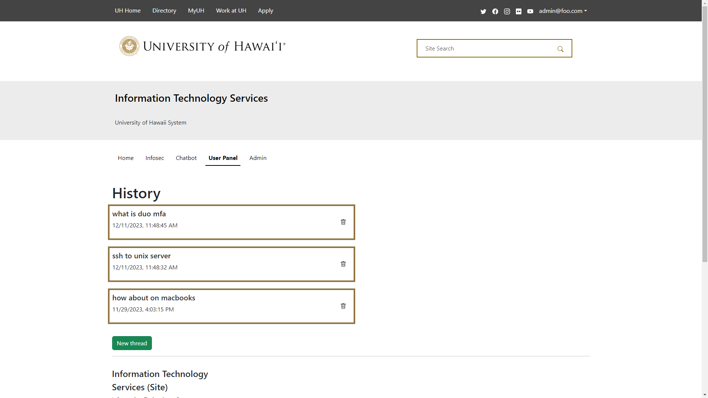

# Overview

The current UH ITS Ask Us page involves sifting through a barrage of articles to find answers. However, many people dont really want to read long texts, so the next best alternative is reaching out to the help desk. Unfortunately, the current setup of the Ask Us page is not ideal, because it can overwhelm support staff, resulting in slower response times and an increased workload for everyone involved. To enhance efficiency and user experience, I worked with 3 fellow students to develop an interactive chatbot. It’s much more convenient to get a response than to read through a wall of articles.

# Tech Stack

Our chatbot is built on the Meteor full-stack JavaScript platform, which forms the core of our system's architecture. This platform works well with client and server-side functionalities, essential for the real-time and interactive aspects of our chatbot. The choice of Meteor ensures seamless integration of various components and aids in the handling of data synchronization and management tasks. For the user interface, we have used React Bootstrap for its dynamic and responsive design capabilities to make our chatbot look pleasing to users. Our AI runs on the OpenAI API using the GPT 3.5 turbo model. We have developed custom functions for fetching text embeddings from OpenAI and computing cosine similarity. These functions play a crucial role in accurately interpreting user queries and matching them with relevant information from our database. The backend of our system is powered by MongoDB, a NoSQL database that handles our application's data management needs, including storing articles, user sessions, and chat logs.

# My Role

I concentrated on the chat history feature. I created a collection of messages and a collection of sessions on the backend to support the chat history functionality. The user history operates such that when a user logs into the website, a chat session is initiated for that particular tab on the webpage. A new chat session would only be added if the user opens a new tab or logs-in and initiates a new chat session from their user page. I also styled the page where users can see their history.

### User Chat History

# Experience

This was my first time participating in a coding-related group project. It was a beneficial experience that honed my ability to work collaboratively. The GitHub Organization was very useful for us to keep our duties organized. We utilized project boards and issues in order to assign tasks to each of our group members. The knowledge and experience gained from this project will undoubtedly come in handy in real world work settings.

[Project Page](https://regex-ics314.github.io/)

[Source Code](https://github.com/Regex-ICS314/AskUs)