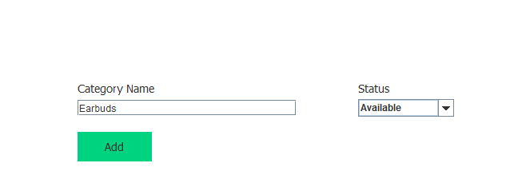
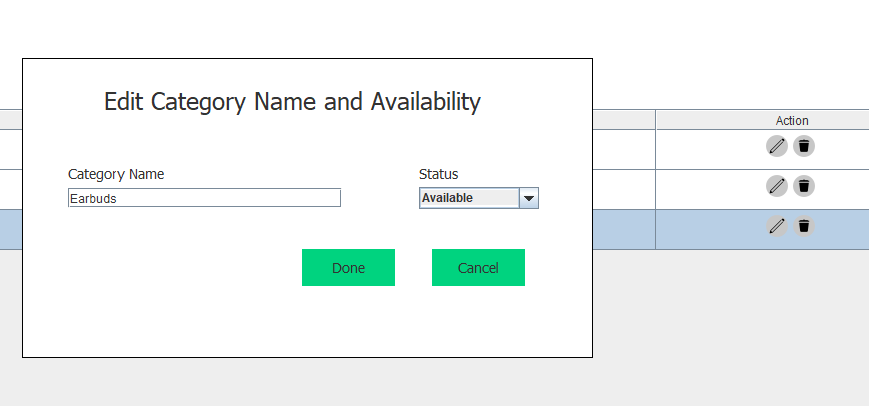
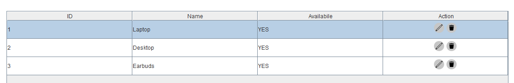
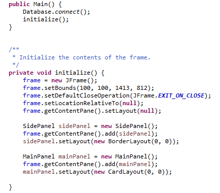
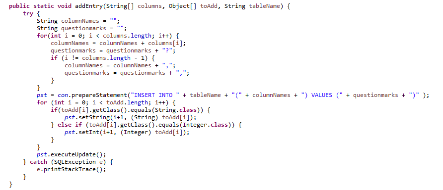
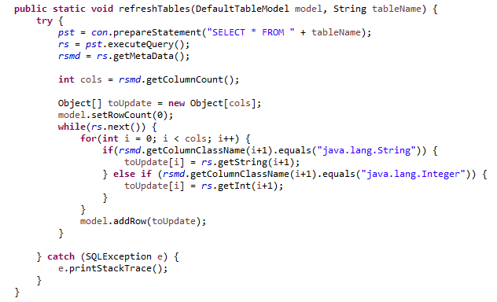
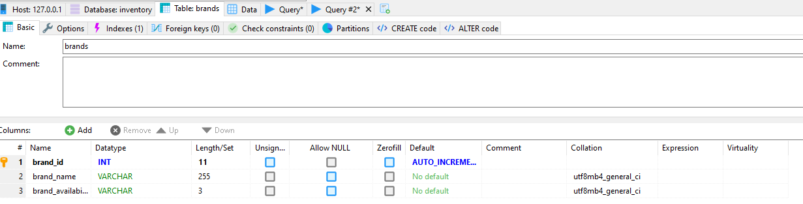
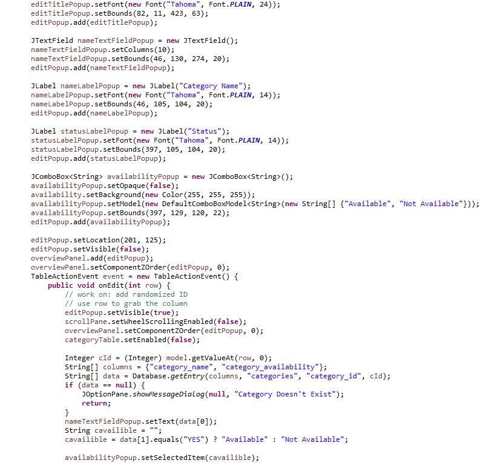
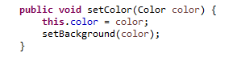

I developed an electronics system to manage a hypothetical shop using Java, the Swing framework for the GUI, and a MySQL server for the backend. The system allows the shop owner or staff to add, edit, or delete product categories and brands, the product itself, and orders. Furthermore, the system tracks the amount of revenue and orders.

Note: As of right now, this project is not completed yet. I only implemented the database tables for the brand and category panels.

## Designing the Manager

I utilized 4 packages for this program. A database package containing a single class for methods that interact with the database, a screen package where each class represents a section with its respective GUI components and graphics, a main package that initializes the main frame and connects to the database, and a customJComponent package that has the classes where I modified existing Swing components.

# Main

These are the methods that connect to the database and initialize the main frame.

# Database

This is a method that adds an entry to the database. The method takes parameters of the table name, what’s being added, and the column names for the query.

This is a method that refreshes the table showing the entries from the database.

Here is what one of my tables looks like. I used a program called HeidiSQL to internally manage the database.

# Each Panel/Screen

This is some code for the category panel. GUI Components, labels, and graphics are initialized here.

# Custom Components

This is a method I implemented to make a custom JButton that is able to have a different color.

## What I got out of this project and moving forward

Coding this shop management system allowed me to practice my Java skills in this project, and I was able to become more familiar with the Swing framework. I also gained more experience in database design and SQL queries.

I want to improve this project by making it feel more modern. Right now all the components and the font feel too sharp compared to today’s look in GUIs where the components are more soft and round. Additionally, I could learn how to create animations to make it look more pleasing to use.

[Source Code](https://github.com/josephaverion/ElectronicsShopManager/tree/master/Electronics%20Shop%20Management%20System/src)
