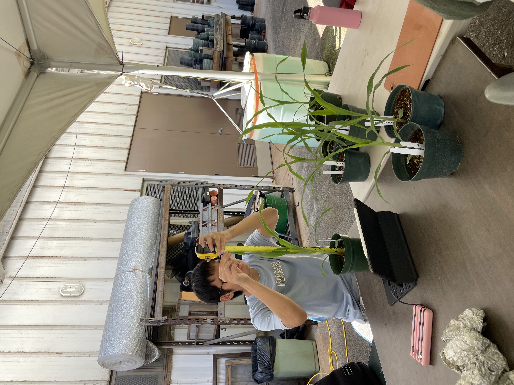
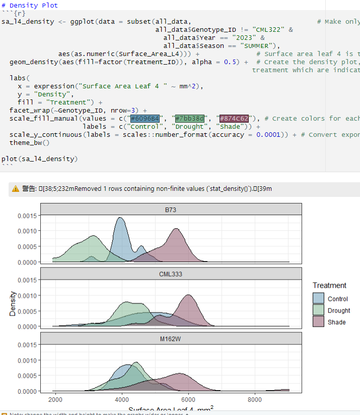

  
  
  
   

## Project Info

At the beginning of summer 2023, I worked with 5 biology/agriculture and 4 computer science undergraduates to do research on Maize (corn). We grew 3 different lines of Maize in three different environmental conditions in a controlled greenhouse. We collected data on both the root and shoot traits of the Maize and used data science methods that were learned from morning workshops on the collected data to find patterns or traits that seemed interesting to us. We then used R to visualize our findings, put our findings on a poster, and presented them at the SURE summer symposium. Furthermore, we participated in weekly field trips every Friday to experience Hawaii’s unique agriculture diversity, consisting of research, mass production, and local agriculture sites.

## My Role

During the data collection phase, the 10 of us were split into three groups to manage each environment in our experiment. I was working with the Maize that was grown in the shade environment. Within our group, we rotated the task of watering the plant, measuring it, and inputting the data. After terminating the plant, everybody worked together to scan the leaves and the roots. Then we split off and formed a group that uses programs to get data from the images and a group that cleans up all the data so there can be no errors when graphing it. I worked on collecting data from the root images, using a program called Rhizovision. Once all the data was cleaned up, we split into groups of 2 to create 5 posters. During the poster creation phase, I was mainly responsible for the design and looks of the poster and all the graphs.

## Conclusion

I gained a lot of meaningful skills out of this internship. One of the major things I improved was my communication and teamwork. This was a group-oriented project, so we each put in effort together to successfully finish our research. In the process of our research, I learned a lot of biology terms about Maize and plants. I also learned argiculture methods to maintain plants in a controlled state. From the workshops, I was able to learn data science methods such as regression,and machine learning. Then I was able to apply those data science methods visually onto graphs learning R, a programming language for displaying graphs.

[Click here for a link to a PDF of my poster](https://josephaverion.github.io/projects/projectExtensions/Maize-REEU-Poster.pdf)

[Click here for a link to the code I used to create the graphs in my poster](https://github.com/josephaverion/MaizeResearchPosterCode/blob/main/REEU_Amanda_Joseph_R_Code.Rmd)

